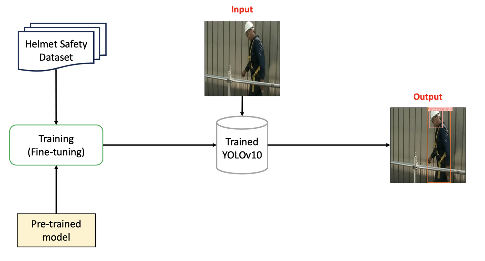

# Helmet-Safety-Detection

In this project, we will build a program to detect whether workers at a construction site are wearing safety helmets. The model we will use is YOLOv10. Accordingly, the input and output of the program are:

- Input: An image.
- Output: The coordinates (bounding box) of the workers and the helmets.

## Pipeline

